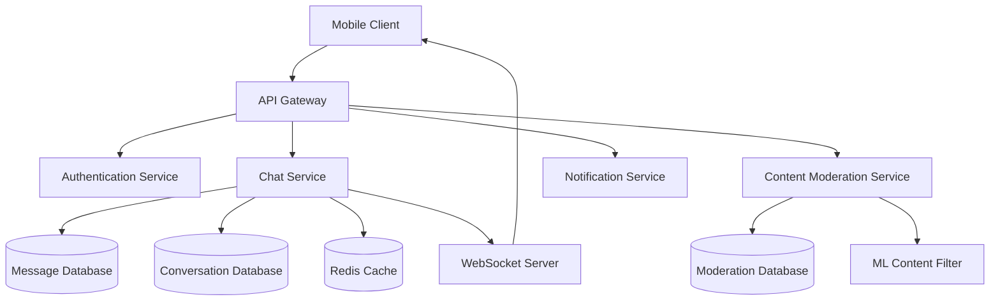

# Chat Messaging Design Document

## Overview

The chat messaging system enables real-time communication between matched users through a secure, feature-rich messaging interface. The system provides conversation management, message status tracking, safety features, and content moderation to facilitate meaningful connections while maintaining user safety.

The design follows a client-server architecture with WebSocket connections for real-time messaging, REST APIs for conversation management, and a modular component structure for scalability and maintainability.

## Architecture

### High-Level Architecture



### Core Services

1. **Chat Service**: Handles message sending, receiving, and conversation management
2. **WebSocket Server**: Manages real-time connections and message delivery
3. **Content Moderation Service**: Filters inappropriate content and handles reports
4. **Notification Service**: Manages push notifications for offline users
5. **Authentication Service**: Validates user permissions and match status

### Data Flow

1. User sends message through mobile client
2. Message passes through API Gateway to Chat Service
3. Chat Service validates match status and permissions
4. Content Moderation Service scans message for inappropriate content
5. If approved, message is stored in database and sent via WebSocket
6. Recipient receives real-time message update
7. Message status updates are sent back to sender

## Components and Interfaces

### Frontend Components

#### ConversationListScreen

- Displays sorted list of conversations by most recent activity
- Shows match photo, name, last message preview, timestamp
- Handles unread indicators and conversation navigation
- Implements pull-to-refresh and infinite scrolling
- Shows encouraging message when no conversations exist

#### ChatScreen

- Real-time message interface with input field
- Message bubbles with status indicators
- Typing indicators and message timestamps
- Long-press menu for message actions

#### MessageBubble

- Individual message display component
- Status indicators (sent, delivered, read)
- Timestamp and sender information
- Support for different message types

#### ConversationActions

- Delete, archive, report, and block functionality
- Confirmation dialogs for destructive actions
- Integration with moderation reporting

### Backend APIs

#### Chat API Endpoints

```
POST /api/v1/conversations/{conversationId}/messages
GET /api/v1/conversations
GET /api/v1/conversations/{conversationId}/messages
DELETE /api/v1/conversations/{conversationId}
PUT /api/v1/conversations/{conversationId}/archive
POST /api/v1/conversations/{conversationId}/report
POST /api/v1/users/{userId}/block
```

#### WebSocket Events

```
// Client to Server
message_send
typing_start
typing_stop
message_read

// Server to Client
message_received
message_status_update
typing_indicator
conversation_updated
```

### Service Interfaces

#### ChatService

```typescript
interface ChatService {
  sendMessage(
    conversationId: string,
    content: string,
    senderId: string
  ): Promise<Message>;
  getConversations(userId: string): Promise<Conversation[]>;
  getMessages(
    conversationId: string,
    limit: number,
    offset: number
  ): Promise<Message[]>;
  markAsRead(conversationId: string, userId: string): Promise<void>;
  deleteConversation(conversationId: string, userId: string): Promise<void>;
  archiveConversation(conversationId: string, userId: string): Promise<void>;
}
```

#### ModerationService

```typescript
interface ModerationService {
  scanMessage(content: string): Promise<ModerationResult>;
  reportConversation(
    conversationId: string,
    reporterId: string,
    reason: string
  ): Promise<void>;
  blockUser(blockerId: string, blockedId: string): Promise<void>;
  checkRateLimit(userId: string): Promise<boolean>;
}
```

## Data Models

### Message Model

```typescript
interface Message {
  id: string;
  conversationId: string;
  senderId: string;
  content: string;
  timestamp: Date;
  status: "sent" | "delivered" | "read";
  messageType: "text" | "system";
  moderationStatus: "pending" | "approved" | "flagged";
}
```

### Conversation Model

```typescript
interface Conversation {
  id: string;
  participants: string[];
  lastMessage: Message;
  lastActivity: Date;
  unreadCount: { [userId: string]: number };
  status: "active" | "archived" | "deleted";
  createdAt: Date;
}
```

### User Conversation State

```typescript
interface UserConversationState {
  userId: string;
  conversationId: string;
  isArchived: boolean;
  isDeleted: boolean;
  lastReadMessageId: string;
  lastReadTimestamp: Date;
}
```

### Moderation Report

```typescript
interface ModerationReport {
  id: string;
  conversationId: string;
  reporterId: string;
  reportedUserId: string;
  reason: string;
  status: "pending" | "reviewed" | "resolved";
  createdAt: Date;
}
```

## Error Handling

### Client-Side Error Handling

1. **Network Connectivity**: Implement offline message queuing and retry mechanisms
2. **WebSocket Disconnection**: Automatic reconnection with exponential backoff
3. **Message Send Failures**: Show error indicators with retry options
4. **Rate Limiting**: Display user-friendly messages when limits are exceeded

### Server-Side Error Handling

1. **Database Failures**: Implement circuit breakers and fallback mechanisms
2. **Content Moderation Failures**: Default to manual review queue
3. **WebSocket Server Issues**: Load balancing and failover to backup servers
4. **Authentication Failures**: Clear error messages and redirect to login

### Error Response Format

```typescript
interface ErrorResponse {
  error: {
    code: string;
    message: string;
    details?: any;
  };
  timestamp: string;
  requestId: string;
}
```

## Testing Strategy

### Unit Testing

- Individual component testing for UI components
- Service layer testing with mocked dependencies
- Data model validation testing
- WebSocket event handler testing

### Integration Testing

- API endpoint testing with real database
- WebSocket connection and message flow testing
- Content moderation pipeline testing
- Authentication and authorization testing

### End-to-End Testing

- Complete user conversation flows
- Real-time messaging scenarios
- Cross-platform compatibility testing
- Performance testing under load

### Security Testing

- Input validation and sanitization
- Authentication bypass attempts
- Rate limiting effectiveness
- Content moderation accuracy

### Test Data Management

- Automated test data generation
- Database seeding for consistent test environments
- Mock external service responses
- Test user account management

## Design Decisions and Rationales

### Real-Time Communication

**Decision**: Use WebSockets for real-time messaging
**Rationale**: Provides low-latency bidirectional communication essential for chat experience. Fallback to polling for unreliable connections.

### Message Status Tracking

**Decision**: Implement three-tier status system (sent, delivered, read)
**Rationale**: Provides clear feedback to users about message state while balancing complexity and user experience.

### Content Moderation

**Decision**: Hybrid approach with automated scanning and manual review
**Rationale**: Automated filtering catches obvious violations quickly, while manual review handles nuanced cases and appeals.

### Database Design

**Decision**: Separate message and conversation storage with denormalized conversation metadata
**Rationale**: Optimizes for read performance in conversation lists while maintaining message history integrity.

### Rate Limiting

**Decision**: Implement progressive rate limiting based on user behavior
**Rationale**: Prevents spam while allowing natural conversation flow for legitimate users.

### Conversation Management

**Decision**: Soft delete with user-specific visibility states
**Rationale**: Allows users to manage their chat experience while preserving data for moderation and the other participant.

### Safety Features

**Decision**: Proactive content scanning with user reporting mechanisms
**Rationale**: Creates multiple layers of protection while empowering users to maintain their own safety.
