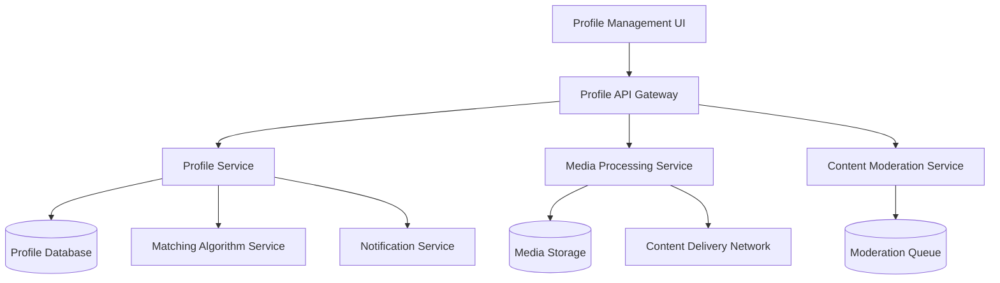

# Profile Management Design Document

## Overview

The Profile Management system enables users to create, maintain, and control their dating profiles through a comprehensive interface that handles basic information, media content (photos and videos), interests, preferences, and privacy controls. The system is designed with a modular architecture that supports real-time updates, content moderation, and seamless integration with the matching algorithm.

The design prioritizes user experience through immediate feedback, progressive enhancement, and robust error handling while maintaining strict privacy controls and content safety standards.

## Architecture

### High-Level Architecture



### Service Layer Design

The system follows a microservices architecture with clear separation of concerns:

- **Profile Service**: Core profile data management and validation
- **Media Processing Service**: Handles photo/video upload, compression, and storage
- **Content Moderation Service**: Automated and manual content review
- **Privacy Service**: Manages visibility controls and user blocking
- **Matching Integration Service**: Syncs profile changes with matching algorithm

## Components and Interfaces

### Core Components

#### ProfileManager

Primary orchestrator for all profile operations with the following responsibilities:

- Coordinates between UI and backend services
- Manages state synchronization
- Handles optimistic updates with rollback capability
- Implements caching strategy for frequently accessed data

**Key Methods:**

```typescript
interface ProfileManager {
  updateBasicInfo(
    userId: string,
    info: BasicProfileInfo
  ): Promise<ProfileUpdateResult>;
  uploadMedia(
    userId: string,
    media: MediaFile,
    type: "photo" | "video"
  ): Promise<MediaUploadResult>;
  updateInterests(
    userId: string,
    interests: string[]
  ): Promise<InterestUpdateResult>;
  updatePrivacySettings(
    userId: string,
    settings: PrivacySettings
  ): Promise<PrivacyUpdateResult>;
}
```

#### MediaProcessor

Handles all media-related operations with built-in validation and processing:

- Image compression and thumbnail generation
- Video compression and thumbnail extraction
- Format validation and size checking
- Progressive upload with resume capability

**Design Decision Rationale**: Separate media processing allows for independent scaling and specialized optimization for different media types.

#### ContentModerator

Implements multi-layered content review system:

- Automated scanning using ML models for inappropriate content
- Queue management for manual review
- Real-time flagging and temporary content hiding
- Integration with user reporting system

#### PrivacyController

Manages all privacy-related functionality:

- Profile visibility controls
- User blocking and unblocking
- Location precision settings
- Data access logging for compliance

### API Interface Design

#### REST Endpoints

```
GET    /api/profile/{userId}                    - Retrieve profile data
PUT    /api/profile/{userId}/basic             - Update basic information
POST   /api/profile/{userId}/media             - Upload photo/video
DELETE /api/profile/{userId}/media/{mediaId}   - Remove media
PUT    /api/profile/{userId}/interests         - Update interests
PUT    /api/profile/{userId}/preferences       - Update matching preferences
PUT    /api/profile/{userId}/privacy           - Update privacy settings
```

#### WebSocket Events

Real-time updates for immediate user feedback:

```
profile.updated          - Basic info changes
media.upload.progress    - Upload progress updates
media.processing.status  - Media processing status
moderation.flagged       - Content flagged for review
```

## Data Models

### Profile Data Structure

```typescript
interface UserProfile {
  userId: string;
  basicInfo: {
    name: string;
    age: number;
    bio: string;
    occupation: string;
    location: {
      city: string;
      coordinates: [number, number];
      precision: "exact" | "approximate" | "city";
    };
  };
  media: {
    photos: ProfilePhoto[];
    videos: ProfileVideo[];
    primaryPhotoId?: string;
  };
  interests: string[];
  preferences: {
    ageRange: [number, number];
    maxDistance: number;
    genderPreference: string[];
  };
  privacy: {
    isPrivate: boolean;
    blockedUsers: string[];
    visibilitySettings: {
      showAge: boolean;
      showLocation: boolean;
      showLastActive: boolean;
    };
  };
  metadata: {
    createdAt: Date;
    updatedAt: Date;
    lastActiveAt: Date;
    profileCompleteness: number;
  };
}

interface ProfilePhoto {
  id: string;
  url: string;
  thumbnailUrl: string;
  uploadedAt: Date;
  moderationStatus: "pending" | "approved" | "rejected";
  order: number;
}

interface ProfileVideo {
  id: string;
  url: string;
  thumbnailUrl: string;
  duration: number;
  uploadedAt: Date;
  moderationStatus: "pending" | "approved" | "rejected";
}
```

### Database Schema Design

**Design Decision**: Using a hybrid approach with primary profile data in a relational database for ACID compliance and media metadata in a document store for flexibility.

**Profile Table** (PostgreSQL):

- Stores basic info, preferences, and privacy settings
- Optimized for frequent reads and updates
- Includes indexes on location and matching criteria

**Media Collections** (MongoDB):

- Flexible schema for evolving media metadata
- Efficient querying for media management
- Built-in GridFS for large file handling

## Error Handling

### Validation Strategy

**Client-Side Validation**:

- Immediate feedback for format errors
- File size and type validation before upload
- Real-time character counting for bio and other text fields

**Server-Side Validation**:

- Comprehensive data validation with detailed error messages
- Business rule enforcement (age restrictions, interest limits)
- Sanitization of user input to prevent XSS attacks

### Error Response Format

```typescript
interface ErrorResponse {
  error: {
    code: string;
    message: string;
    field?: string;
    details?: Record<string, any>;
  };
  timestamp: string;
  requestId: string;
}
```

### Retry and Recovery Mechanisms

**Media Upload Resilience**:

- Chunked upload with resume capability
- Automatic retry with exponential backoff
- Fallback to lower quality if processing fails

**Profile Update Conflicts**:

- Optimistic locking with version numbers
- Conflict resolution with user notification
- Automatic merge for non-conflicting changes

## Testing Strategy

### Unit Testing

- **Profile Service**: Test all CRUD operations and validation logic
- **Media Processor**: Test compression, format validation, and error handling
- **Privacy Controller**: Test visibility rules and blocking functionality
- **Content Moderator**: Test flagging logic and queue management

### Integration Testing

- **API Endpoints**: Test complete request/response cycles
- **Database Operations**: Test data consistency and transaction handling
- **External Service Integration**: Test CDN uploads and moderation API calls
- **Real-time Updates**: Test WebSocket event delivery

### End-to-End Testing

- **Profile Creation Flow**: Complete user journey from signup to profile completion
- **Media Upload Flow**: Photo and video upload with processing verification
- **Privacy Settings**: Test visibility changes across the platform
- **Content Moderation**: Test flagging and review workflow

### Performance Testing

- **Load Testing**: Simulate concurrent profile updates and media uploads
- **Media Processing**: Test compression performance under load
- **Database Performance**: Test query performance with large datasets
- **CDN Performance**: Test media delivery speed across regions

### Security Testing

- **Input Validation**: Test against injection attacks and malformed data
- **File Upload Security**: Test malicious file upload prevention
- **Privacy Controls**: Verify user data isolation and access controls
- **Content Security**: Test moderation bypass attempts

## Implementation Considerations

### Performance Optimizations

**Caching Strategy**:

- Redis cache for frequently accessed profile data
- CDN caching for media content with appropriate TTL
- Browser caching for static profile elements

**Database Optimization**:

- Indexed queries for location-based searches
- Read replicas for profile viewing operations
- Connection pooling for high-concurrency scenarios

### Scalability Considerations

**Horizontal Scaling**:

- Stateless service design for easy replication
- Database sharding by user ID for profile data
- Separate media processing workers for upload handling

**Content Delivery**:

- Global CDN for media content
- Regional API gateways for reduced latency
- Async processing for non-critical operations

### Security Measures

**Data Protection**:

- Encryption at rest for sensitive profile data
- HTTPS enforcement for all API communications
- Regular security audits and penetration testing

**Privacy Compliance**:

- GDPR-compliant data handling and deletion
- User consent tracking for data processing
- Audit logging for data access and modifications

This design provides a robust foundation for the profile management system while maintaining flexibility for future enhancements and ensuring excellent user experience through responsive design and comprehensive error handling.
