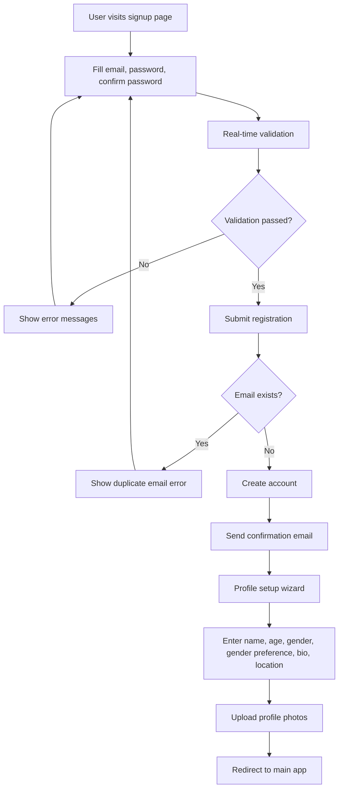
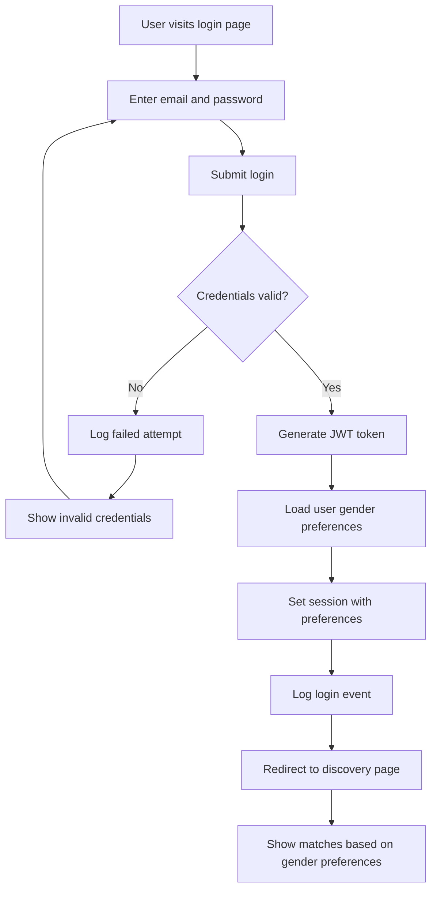
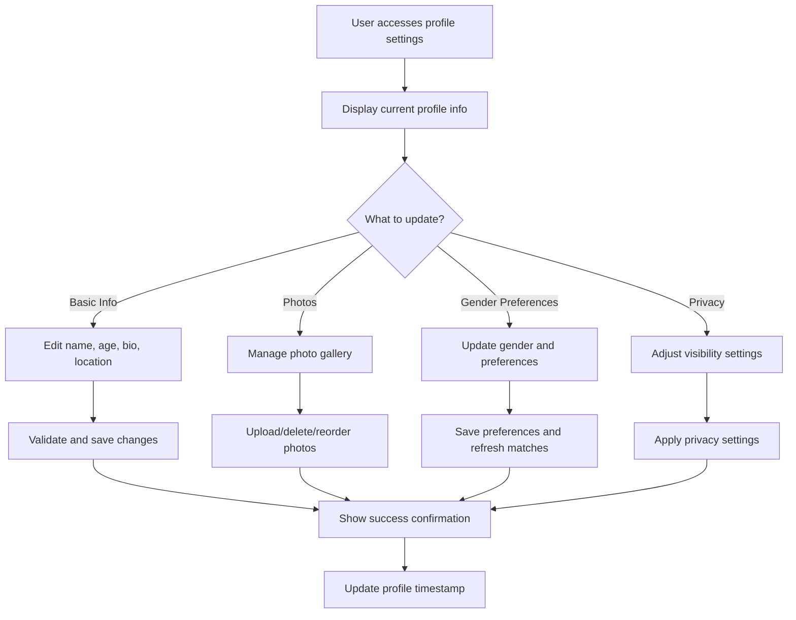
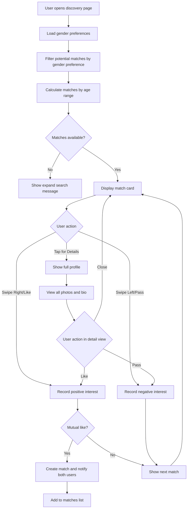
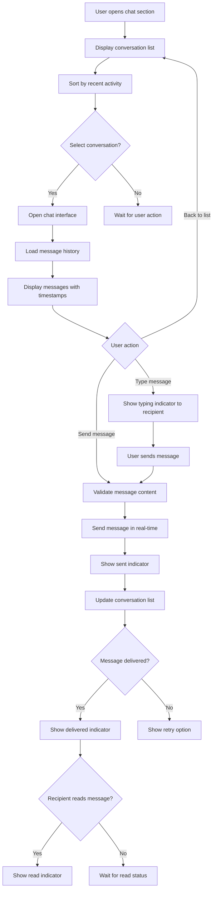
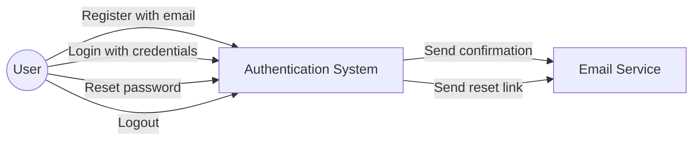
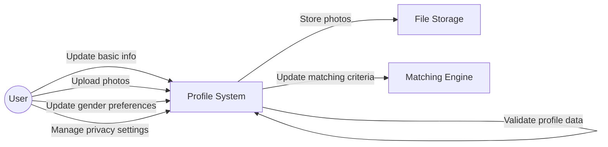
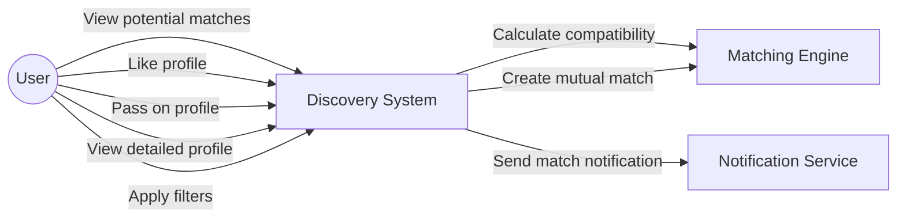
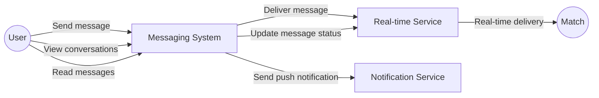

# Dating Platform Flows and Use Case Diagrams

## User Flow Diagrams

### User Signup Flow

### User Login Flow

### Profile Management Flow

### Match Discovery Flow

### Chat Messaging Flow

## Use Case Diagrams

### User Authentication Use Cases

### Profile Management Use Cases

### Match Discovery Use Cases

### Chat Messaging Use Cases

## Key User Personas

### Primary Actors

1. **User**: Individual looking for romantic connections through the dating platform
2. **Match**: Another user who appears in discovery or has mutual interest
3. **System**: Automated processes for matching, validation, and notifications

### Secondary Actors

1. **Email Service**: External service for sending verification and notifications

2. **File Storage**: Service for storing uploaded profile photos
3. **Notification Service**: System for sending match alerts and messages
4. **Real-time Service**: WebSocket service for instant messaging

## Security Considerations

### Authentication Security

- Password hashing using bcrypt with salt
- JWT tokens with 1-hour expiration and refresh tokens
- Failed login attempt logging for security monitoring
- Secure session management with gender preference data

### Data Protection

- HTTPS encryption for all endpoints
- Secure file upload validation for profile photos
- Personal data encryption at rest
- Audit logging for all authentication and matching events

### Privacy Protection

- Gender preference data stored securely
- Profile visibility controls
- User blocking and privacy settings
- Secure message delivery between matched users

### Content Moderation

- Photo upload validation and content filtering
- Inappropriate content flagging system
- User reporting mechanisms
- Automated content moderation for safety
