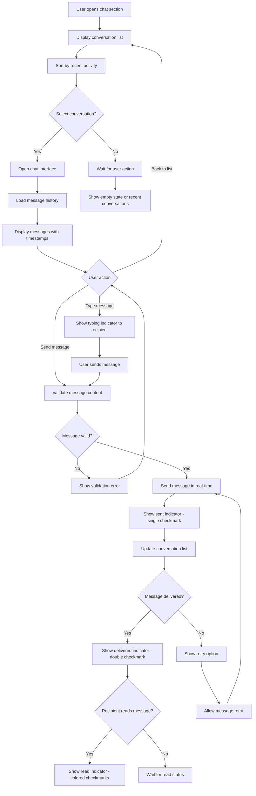
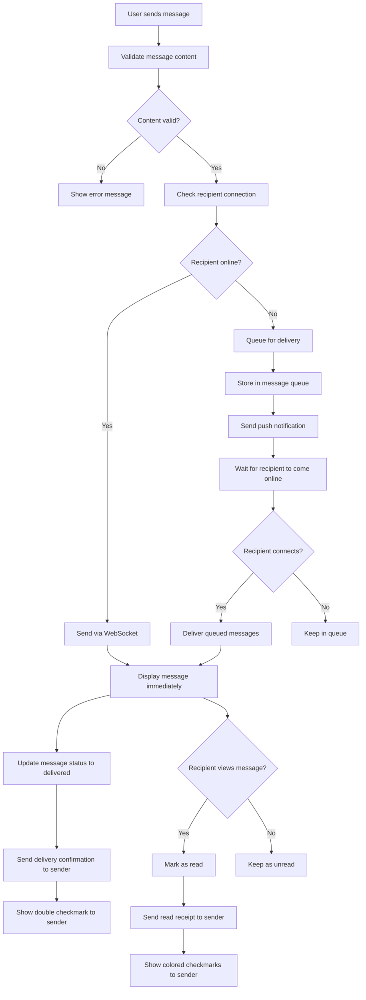
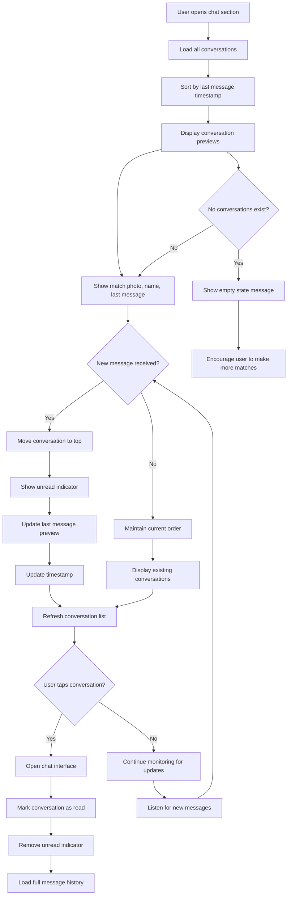
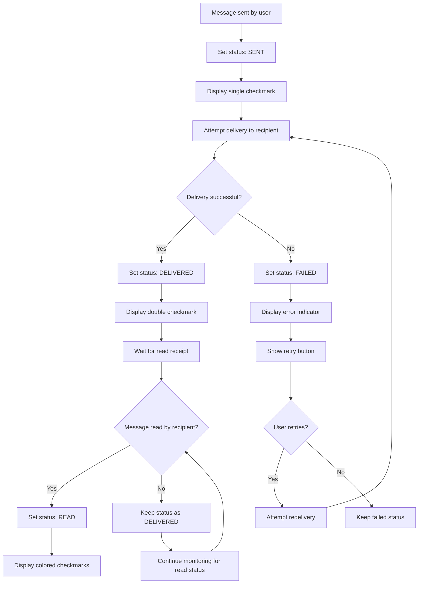
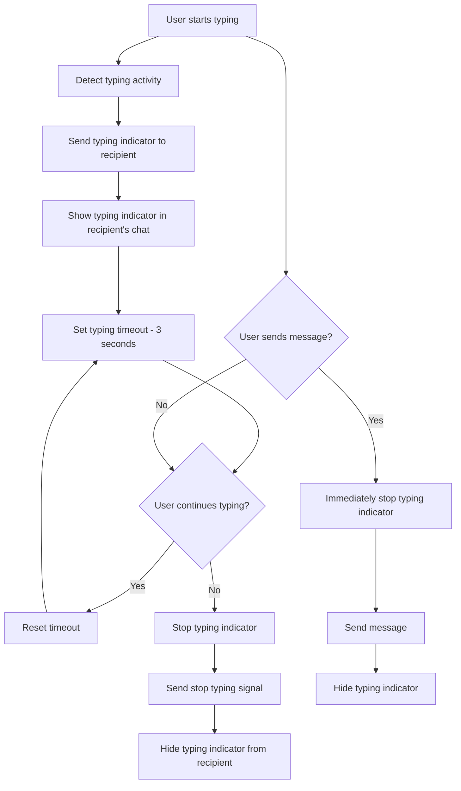
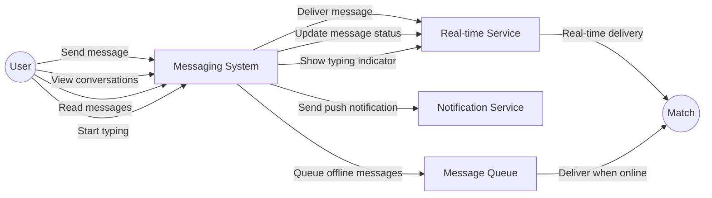

# Chat Messaging Flow Diagram

## Chat Messaging Flow

## Real-time Message Delivery Flow

## Conversation List Management Flow

## Message Status Tracking Flow

## Typing Indicator Flow

## Use Case Diagram

