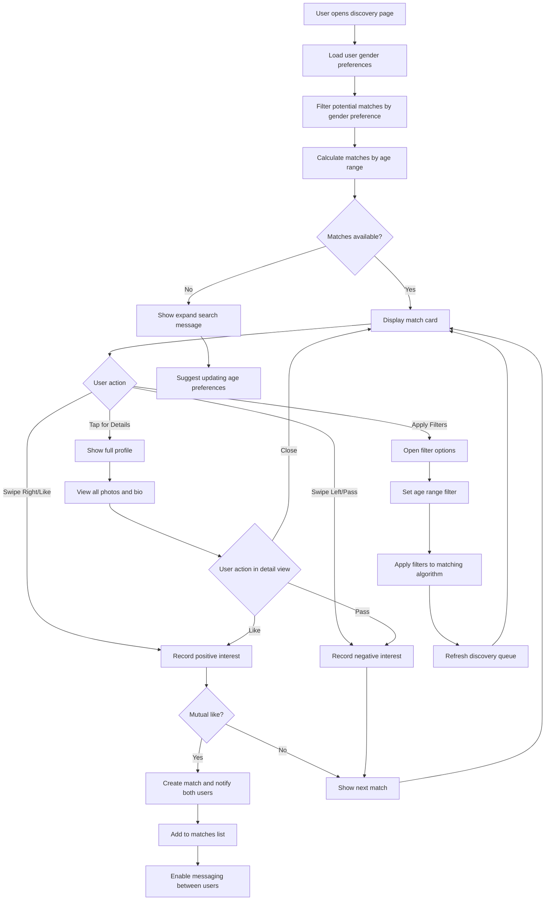
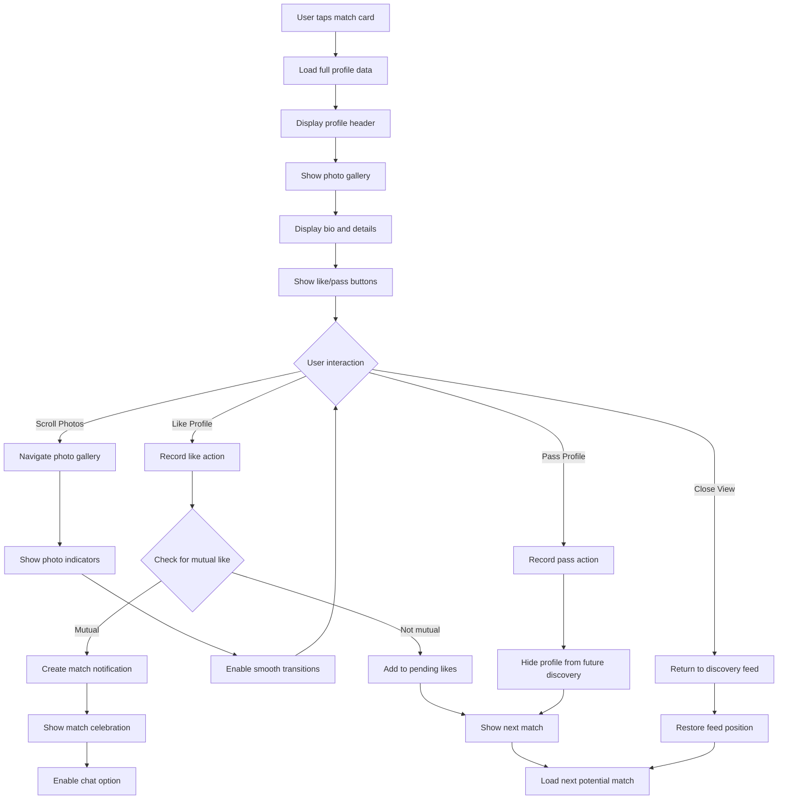
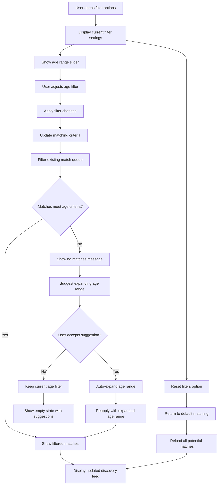
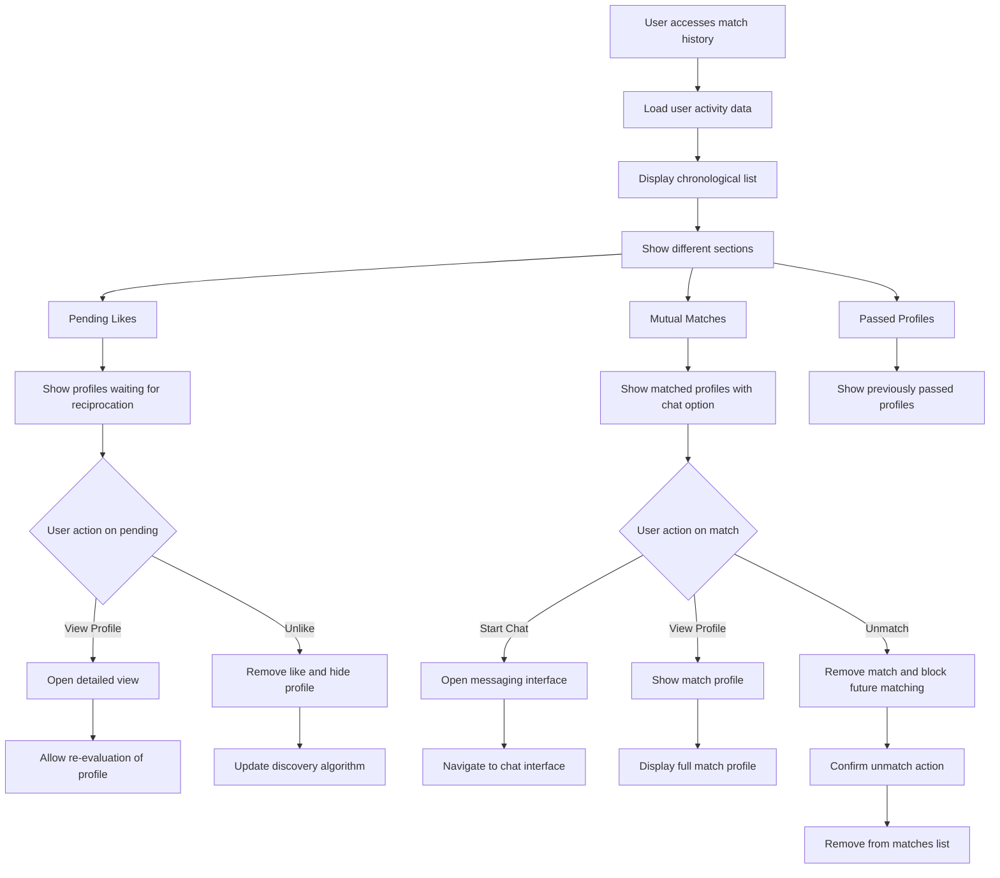
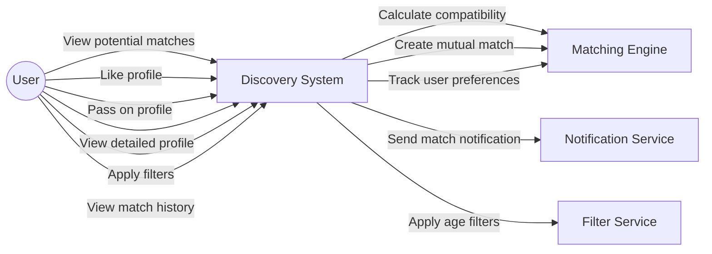

# Match Discovery Flow Diagram

## Match Discovery Flow

```mermaid
flowchart TD
    A[User opens discovery page] --> B[Load user gender preferences]
    B --> C[Filter potential matches by gender preference]
    C --> D[Calculate matches by age range]
    D --> E{Matches available?}
    E -->|No| F[Show expand search message]
    E -->|Yes| G[Display match card]

    G --> H{User action}
    H -->|Swipe Right/Like| I[Record positive interest]
    H -->|Swipe Left/Pass| J[Record negative interest]
    H -->|Tap for Details| K[Show full profile]
    H -->|Apply Filters| L[Open filter options]

    I --> M{Mutual like?}
    M -->|Yes| N[Create match and notify both users]
    M -->|No| O[Show next match]

    J --> O

    K --> P[View all photos and bio]
    P --> Q{User action in detail view}
    Q -->|Like| I
    Q -->|Pass| J
    Q -->|Close| G

    L --> R[Set age range filter]
    R --> S[Apply filters to matching algorithm]
    S --> T[Refresh discovery queue]
    T --> G

    N --> U[Add to matches list]
    U --> V[Enable messaging between users]
    O --> G

    F --> W[Suggest updating age preferences]
```

## Detailed Profile View Flow

```mermaid
flowchart TD
    A[User taps match card] --> B[Load full profile data]
    B --> C[Display profile header]
    C --> D[Show photo gallery]
    D --> E[Display bio and details]
    E --> F[Show like/pass buttons]

    F --> G{User interaction}
    G -->|Scroll Photos| H[Navigate photo gallery]
    G -->|Like Profile| I[Record like action]
    G -->|Pass Profile| J[Record pass action]
    G -->|Close View| K[Return to discovery feed]

    H --> L[Show photo indicators]
    L --> M[Enable smooth transitions]
    M --> G

    I --> N{Check for mutual like}
    N -->|Mutual| O[Create match notification]
    N -->|Not mutual| P[Add to pending likes]

    J --> Q[Hide profile from future discovery]

    O --> R[Show match celebration]
    P --> S[Show next match]
    Q --> S
    K --> T[Restore feed position]

    R --> U[Enable chat option]
    S --> V[Load next potential match]
    T --> V
```

## Filter Application Flow

```mermaid
flowchart TD
    A[User opens filter options] --> B[Display current filter settings]
    B --> C[Show age range slider]
    C --> D[User adjusts age filter]
    D --> E[Apply filter changes]
    E --> F[Update matching criteria]
    F --> G[Filter existing match queue]
    G --> H{Matches meet age criteria?}
    H -->|Yes| I[Show filtered matches]
    H -->|No| J[Show no matches message]

    J --> K[Suggest expanding age range]
    K --> L{User accepts suggestion?}
    L -->|Yes| M[Auto-expand age range]
    L -->|No| N[Keep current age filter]

    M --> O[Reapply with expanded age range]
    O --> I

    I --> P[Display updated discovery feed]
    N --> Q[Show empty state with suggestions]

    B --> R[Reset filters option]
    R --> S[Return to default matching]
    S --> T[Reload all potential matches]
    T --> P
```

## Match History Flow

```mermaid
flowchart TD
    A[User accesses match history] --> B[Load user activity data]
    B --> C[Display chronological list]
    C --> D[Show different sections]
    D --> E[Pending Likes]
    D --> F[Mutual Matches]
    D --> G[Passed Profiles]

    E --> H[Show profiles waiting for reciprocation]
    F --> I[Show matched profiles with chat option]
    G --> J[Show previously passed profiles]

    H --> K{User action on pending}
    K -->|View Profile| L[Open detailed view]
    K -->|Unlike| M[Remove like and hide profile]

    I --> N{User action on match}
    N -->|Start Chat| O[Open messaging interface]
    N -->|View Profile| P[Show match profile]
    N -->|Unmatch| Q[Remove match and block future matching]

    L --> R[Allow re-evaluation of profile]
    M --> S[Update discovery algorithm]
    O --> T[Navigate to chat interface]
    P --> U[Display full match profile]
    Q --> V[Confirm unmatch action]
    V --> W[Remove from matches list]
```

## Use Case Diagram

```mermaid
graph LR
    User((User))
    System[Discovery System]
    MatchingEngine[Matching Engine]
    NotificationService[Notification Service]
    FilterService[Filter Service]

    User --> |View potential matches| System
    User --> |Like profile| System
    User --> |Pass on profile| System
    User --> |View detailed profile| System
    User --> |Apply filters| System
    User --> |View match history| System

    System --> |Calculate compatibility| MatchingEngine
    System --> |Create mutual match| MatchingEngine
    System --> |Send match notification| NotificationService
    System --> |Apply age filters| FilterService
    System --> |Track user preferences| MatchingEngine
```
