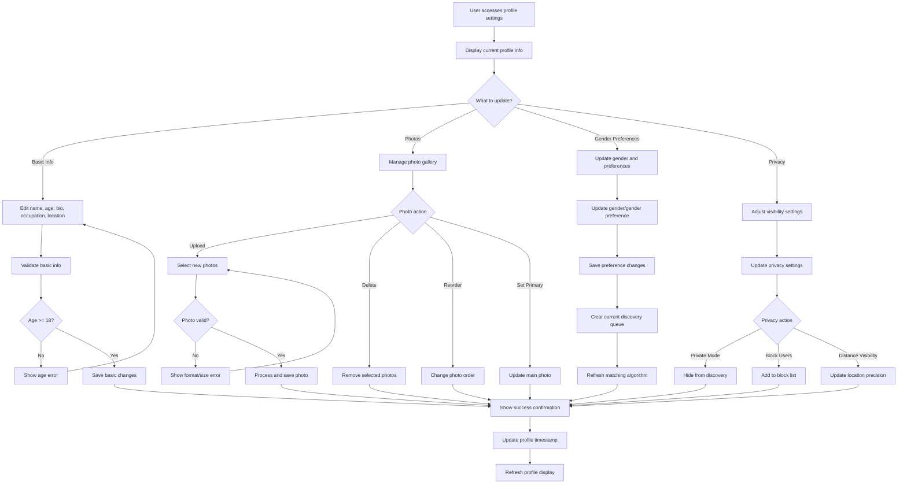
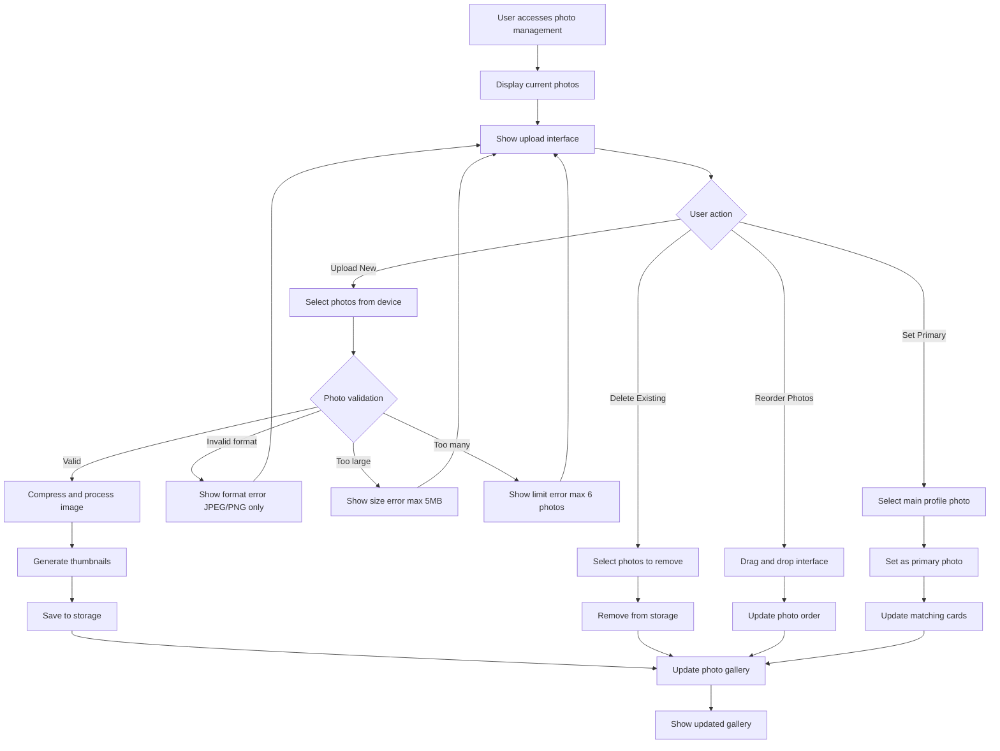
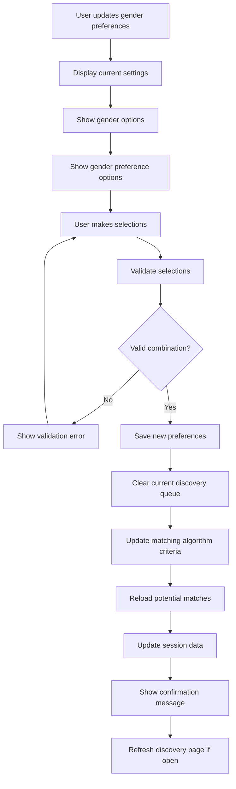
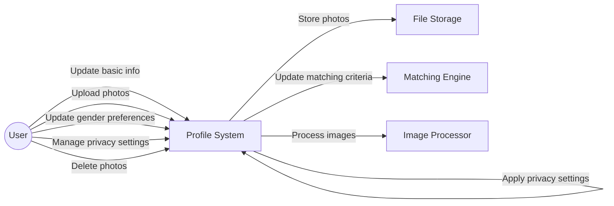

# Profile Management Flow Diagram

## Profile Management Flow

```mermaid
flowchart TD
    A[User accesses profile settings] --> B[Display current profile info]
    B --> C{What to update?}
    C -->|Basic Info| D[Edit name, age, bio, occupation, location]
    C -->|Photos| E[Manage photo gallery]
    C -->|Gender Preferences| F[Update gender and preferences]
    C -->|Privacy| G[Adjust visibility settings]

    D --> H[Validate basic info]
    H --> I{Age >= 18?}
    I -->|No| J[Show age error] --> D
    I -->|Yes| K[Save basic changes]

    E --> L{Photo action}
    L -->|Upload| M[Select new photos]
    L -->|Delete| N[Remove selected photos]
    L -->|Reorder| O[Change photo order]
    L -->|Set Primary| P[Update main photo]

    M --> Q{Photo valid?}
    Q -->|No| R[Show format/size error] --> M
    Q -->|Yes| S[Process and save photo]

    F --> T[Update gender/gender preference]
    T --> U[Save preference changes]
    U --> V[Clear current discovery queue]
    V --> W[Refresh matching algorithm]

    G --> X[Update privacy settings]
    X --> Y{Privacy action}
    Y -->|Private Mode| Z[Hide from discovery]
    Y -->|Block Users| AA[Add to block list]
    Y -->|Distance Visibility| BB[Update location precision]

    K --> CC[Show success confirmation]
    S --> CC
    N --> CC
    O --> CC
    P --> CC
    W --> CC
    Z --> CC
    AA --> CC
    BB --> CC
    CC --> DD[Update profile timestamp]
    DD --> EE[Refresh profile display]
```

## Photo Management Flow

```mermaid
flowchart TD
    A[User accesses photo management] --> B[Display current photos]
    B --> C[Show upload interface]
    C --> D{User action}
    D -->|Upload New| E[Select photos from device]
    D -->|Delete Existing| F[Select photos to remove]
    D -->|Reorder Photos| G[Drag and drop interface]
    D -->|Set Primary| H[Select main profile photo]

    E --> I{Photo validation}
    I -->|Invalid format| J[Show format error JPEG/PNG only]
    I -->|Too large| K[Show size error max 5MB]
    I -->|Too many| L[Show limit error max 6 photos]
    I -->|Valid| M[Compress and process image]

    M --> N[Generate thumbnails]
    N --> O[Save to storage]
    O --> P[Update photo gallery]

    F --> Q[Remove from storage]
    Q --> P

    G --> R[Update photo order]
    R --> P

    H --> S[Set as primary photo]
    S --> T[Update matching cards]
    T --> P

    P --> U[Show updated gallery]

    J --> C
    K --> C
    L --> C
```

## Gender Preference Update Flow

```mermaid
flowchart TD
    A[User updates gender preferences] --> B[Display current settings]
    B --> C[Show gender options]
    C --> D[Show gender preference options]
    D --> E[User makes selections]
    E --> F[Validate selections]
    F --> G{Valid combination?}
    G -->|No| H[Show validation error] --> E
    G -->|Yes| I[Save new preferences]
    I --> J[Clear current discovery queue]
    J --> K[Update matching algorithm criteria]
    K --> L[Reload potential matches]
    L --> M[Update session data]
    M --> N[Show confirmation message]
    N --> O[Refresh discovery page if open]
```

## Use Case Diagram

```mermaid
graph LR
    User((User))
    System[Profile System]
    FileStorage[File Storage]
    MatchingEngine[Matching Engine]
    ImageProcessor[Image Processor]

    User --> |Update basic info| System
    User --> |Upload photos| System
    User --> |Update gender preferences| System
    User --> |Manage privacy settings| System
    User --> |Delete photos| System

    System --> |Store photos| FileStorage
    System --> |Process images| ImageProcessor
    System --> |Update matching criteria| MatchingEngine
    System --> |Validate profile data| System
    System --> |Apply privacy settings| System
```
