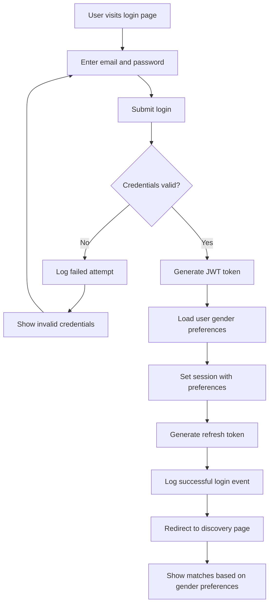
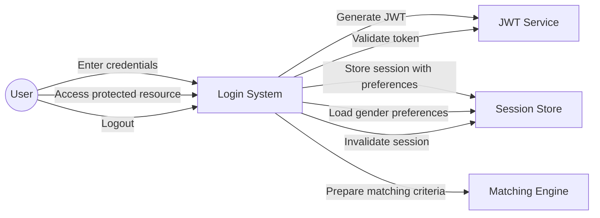
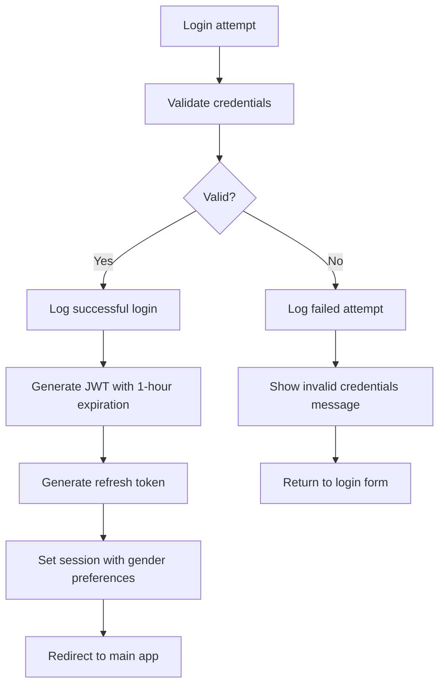

# User Login Flow Diagram

## User Login Flow

```mermaid
flowchart TD
    A[User visits login page] --> B[Enter email and password]
    B --> C[Submit login]
    C --> D{Credentials valid?}
    D -->|No| E[Log failed attempt]
    E --> F[Show invalid credentials] --> B

    D -->|Yes| G[Generate JWT token]
    G --> H[Load user gender preferences]
    H --> I[Set session with preferences]
    I --> J[Generate refresh token]
    J --> K[Log successful login event]
    K --> L[Redirect to discovery page]
    L --> M[Show matches based on gender preferences]
```

## Use Case Diagram

```mermaid
graph LR
    User((User))
    System[Login System]
    TokenService[JWT Service]
    SessionStore[Session Store]
    MatchingEngine[Matching Engine]

    User --> |Enter credentials| System
    User --> |Access protected resource| System
    User --> |Logout| System

    System --> |Generate JWT| TokenService
    System --> |Validate token| TokenService
    System --> |Store session with preferences| SessionStore
    System --> |Load gender preferences| SessionStore
    System --> |Prepare matching criteria| MatchingEngine
    System --> |Invalidate session| SessionStore
```

## Security Flow

```mermaid
flowchart TD
    A[Login attempt] --> B[Validate credentials]
    B --> C{Valid?}
    C -->|No| D[Log failed attempt]
    C -->|Yes| E[Log successful login]

    D --> F[Show invalid credentials message]
    E --> G[Generate JWT with 1-hour expiration]
    G --> H[Generate refresh token]
    H --> I[Set session with gender preferences]

    F --> J[Return to login form]
    I --> K[Redirect to main app]
```
