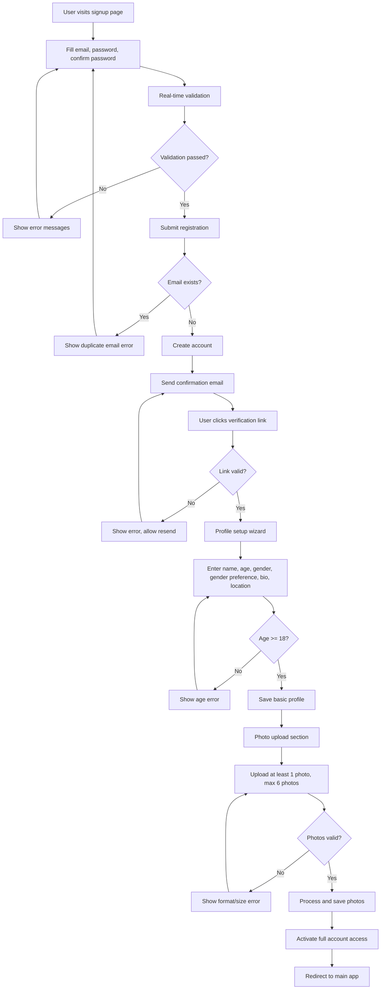
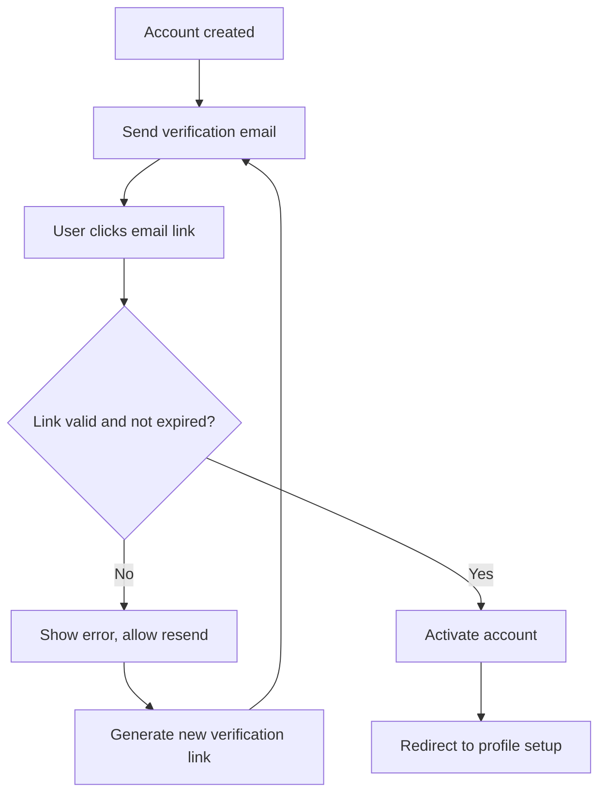
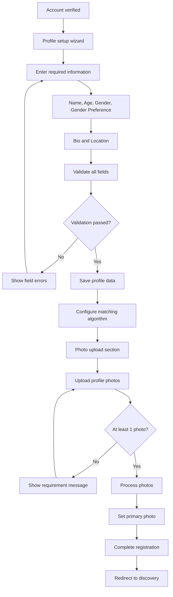
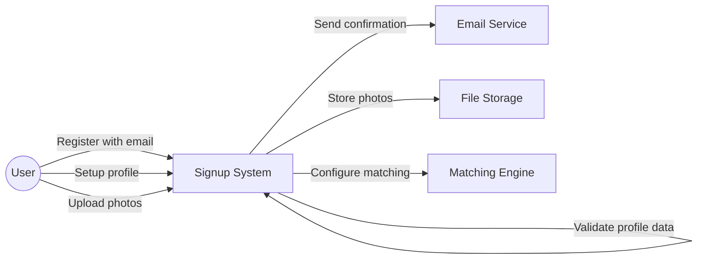

# User Signup Flow Diagram

## User Signup Flow

```mermaid
flowchart TD
    A[User visits signup page] --> B[Fill email, password, confirm password]
    B --> C[Real-time validation]
    C --> D{Validation passed?}
    D -->|No| E[Show error messages] --> B
    D -->|Yes| F[Submit registration]

    F --> G{Email exists?}
    G -->|Yes| H[Show duplicate email error] --> B
    G -->|No| I[Create account]

    I --> J[Send confirmation email]
    J --> K[User clicks verification link]
    K --> L{Link valid?}
    L -->|No| M[Show error, allow resend] --> J
    L -->|Yes| N[Profile setup wizard]
    N --> O[Enter name, age, gender, gender preference, bio, location]
    O --> P{Age >= 18?}
    P -->|No| Q[Show age error] --> O
    P -->|Yes| R[Save basic profile]
    R --> S[Photo upload section]
    S --> T[Upload at least 1 photo, max 6 photos]
    T --> U{Photos valid?}
    U -->|No| V[Show format/size error] --> T
    U -->|Yes| W[Process and save photos]
    W --> X[Activate full account access]
    X --> Y[Redirect to main app]
```

## Verification Flow

```mermaid
flowchart TD
    A[Account created] --> B[Send verification email]
    B --> C[User clicks email link]
    C --> D{Link valid and not expired?}
    D -->|No| E[Show error, allow resend]
    D -->|Yes| F[Activate account]

    F --> G[Redirect to profile setup]

    E --> H[Generate new verification link]
    H --> B
```

## Profile Setup Flow

```mermaid
flowchart TD
    A[Account verified] --> B[Profile setup wizard]
    B --> C[Enter required information]
    C --> D[Name, Age, Gender, Gender Preference]
    D --> E[Bio and Location]
    E --> F[Validate all fields]
    F --> G{Validation passed?}
    G -->|No| H[Show field errors] --> C
    G -->|Yes| I[Save profile data]
    I --> J[Configure matching algorithm]
    J --> K[Photo upload section]
    K --> L[Upload profile photos]
    L --> M{At least 1 photo?}
    M -->|No| N[Show requirement message] --> L
    M -->|Yes| O[Process photos]
    O --> P[Set primary photo]
    P --> Q[Complete registration]
    Q --> R[Redirect to discovery]
```

## Use Case Diagram

```mermaid
graph LR
    User((User))
    System[Signup System]
    EmailService[Email Service]
    FileStorage[File Storage]
    MatchingEngine[Matching Engine]

    User --> |Register with email| System
    User --> |Setup profile| System
    User --> |Upload photos| System

    System --> |Send confirmation| EmailService
    System --> |Store photos| FileStorage
    System --> |Configure matching| MatchingEngine
    System --> |Validate profile data| System
```
